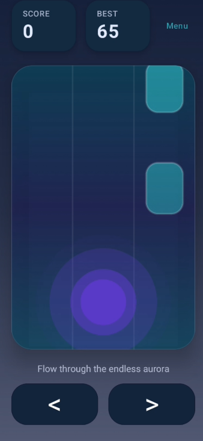

# Everglow

Everglow is a neon-themed endless dodging game built with Jetpack Compose. You steer a light orb across three lanes, weaving around descending obstacles while chaining up a score multiplier and chasing personal bests. The interaction model is tuned for both touch and keyboard input, making it easy to pick up and play on phone or emulator.

## Demo

## Highlights
- Built entirely with Compose for Android, including animations, pointer gestures, and custom drawing on `Canvas`.
- Stateful game loop powered by a pure Kotlin `GameState` model with deterministic collision and spawn logic.
- Layered audio feedback with background music plus cues for lane shifts, collisions, and new high scores.
- Persistent high-score tracking backed by `SharedPreferences`.
- Responsive UI that adapts between the animated game view, a main menu, and post-run overlays.

## Getting Started
1. Open in Android Studio (Giraffe or newer) or install the Android Gradle Plugin 8.4 or later.
2. Sync Gradle; all dependencies are declared in `build.gradle` and fetched automatically.
3. Run on device or emulator via Run > Run "app".
4. Optional: Use the included `build-and-install.ps1` script to build and sideload straight from PowerShell.

> Note: Clone targets must supply their own `local.properties` pointing to an Android SDK. The file is deliberately excluded from version control.

## Audio Assets
Audio files in `app/src/main/res/raw/` with these names so the game can load them automatically:
- `game_music_loop` - seamless background track for runs
- `sfx_lane_shift` - lane change blip
- `sfx_collision` - game over hit
- `sfx_high_score` - new personal best sting
- `sfx_ui_confirm` - selection or confirm tap
- `sfx_ui_back` - back or cancel tap

Files may be `.ogg`, `.mp3`, or `.wav`. Missing files are skipped at runtime.

## Project Structure
- `app/src/main/java/com/boris/everglow/MainActivity.kt` ? Compose entry point that wires up the game loop, UI states, and persistence.
- `app/src/main/java/com/boris/everglow/game/GameState.kt` ? Pure Kotlin domain model responsible for lane movement, obstacle spawning, scoring, and collisions.
- `app/src/main/java/com/boris/everglow/ui/theme/` ? Color palette, typography, and theme helpers for the neon look.
- `app/src/main/res/` ? String resources and launcher assets.

Enjoy the glow!
